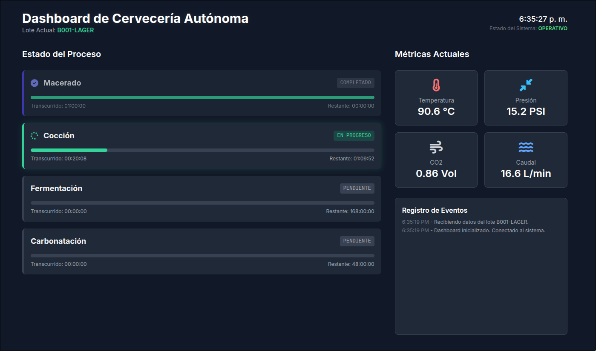

# Proyecto: Cervecería Autónoma - Sistema de Monitoreo y Control

[Este proyecto](https://github.com/jahirmedinacs/smart-beer) implementa un sistema para monitorear, controlar y analizar el proceso de elaboración de cerveza artesanal. La arquitectura está diseñada para ser escalable, robusta y de alta disponibilidad, permitiendo el análisis de datos en tiempo real e histórico.


<br>

--- 

## Arquitectura del Sistema
El sistema se distribuye en múltiples Nodos Sensores/Actuadores por cada olla de cocción y un par de Servidores Centrales redundantes. Esta configuración garantiza que no exista un único punto de fallo.

* Nodos Sensores (3 por Olla): Cada nodo (Raspberry Pi) captura un conjunto de datos y puede ejecutar acciones. Envían sus reportes a un punto de entrada centralizado.

* Servidores Centrales (2 para Redundancia): Dos Mini PCs idénticas operan en paralelo. Un balanceador de carga distribuye el tráfico de ingesta de datos entre ellas. Las bases de datos se mantienen sincronizadas constantemente mediante replicación, asegurando la integridad y disponibilidad de la información.



<br>

--- 

## Arquitectura de Datos y Estrategia de Cacheo
El flujo de datos está diseñado en capas para optimizar la velocidad de respuesta y la eficiencia del almacenamiento.

1. Ingesta: El Servicio de Ingesta recibe un reporte .json.

2. Capa Caliente (Cache - Redis): Inmediatamente, el servicio escribe los datos en Redis. Esta base de datos en memoria actúa como un caché ultrarrápido que almacena los datos de los últimos 3 días. El dashboard de tiempo real consume los datos directamente desde aquí, garantizando una respuesta casi instantánea.

3. Capa Tibia (Persistente - MongoDB): Simultáneamente, los mismos datos se escriben en MongoDB. Esta base de datos sirve como el repositorio principal para datos históricos a mediano plazo. Las consultas a la vista de "Histórico" se realizan contra esta base de datos.

4. Capa Fría (Archivo a Largo Plazo - Cassandra): Un proceso automatizado (no implementado en el prototipo inicial) se encargaría de mover los datos con más de 30 días de antigüedad desde MongoDB hacia Cassandra. Esta capa está optimizada para almacenar volúmenes masivos de datos y realizar análisis complejos a gran escala.

Esta estrategia asegura que las consultas más frecuentes (datos recientes) sean extremadamente rápidas, sin sacrificar la capacidad de almacenar y analizar grandes volúmenes de datos históricos de forma eficiente.

## 📜 Estructura de Directorios
La estructura base del proyecto se mantiene, pero la configuración y despliegue deben considerar la nueva arquitectura.

```bash
├── autonomous_brewing
│   ├── central_server
│   │   ├── api_backend
│   │   │   ├── brewing_project
│   │   │   │   ├── settings.py
│   │   │   │   └── urls.py
│   │   │   ├── data_api
│   │   │   │   ├── management
│   │   │   │   │   └── commands
│   │   │   │   ├── urls.py
│   │   │   │   └── views.py
│   │   │   ├── manage.py
│   │   │   ├── metrics
│   │   │   └── requirements.txt
│   │   ├── database
│   │   │   └── docker-compose.yml
│   │   ├── frontend
│   │   │   ├── history.html
│   │   │   ├── index.html
│   │   │   └── static
│   │   │       ├── css
│   │   │       │   └── styles.css
│   │   │       └── js
│   │   │           ├── app.js
│   │   │           └── history.js
│   │   ├── incoming_reports
│   │   └── services
│   │       └── data_ingestion
│   │           ├── ingest.py
│   │           └── requirements.txt
│   ├── raspberry_pi
│   │   ├── reports
│   │   ├── sensor_simulator.py
│   │   └── sync_reports.sh
│   └── README.md
├── README.md
└── setup.sh

19 directories, 19 files
```


1. raspberry_pi (Nodo Sensor)

* reports/: Almacén temporal de reportes JSON.

* sensor_simulator.py: Script de simulación. En un entorno real, este script leería los sensores físicos.

* sync_reports.sh: Script rsync. Importante: Ahora debe apuntar a la dirección IP virtual (VIP) del balanceador de carga, no a un servidor individual.

2. central_server (Servidor Central)
La configuración de este directorio debe ser idéntica en ambos servidores para garantizar la consistencia.

* incoming_reports/: Carpeta de aterrizaje para los reportes.

* database/:

  * docker-compose.yml: Define los contenedores de las bases de datos. La configuración debe incluir los parámetros para la replicación entre el servidor 1 y el servidor 2 (por ejemplo, un replica set en MongoDB).

* services/data_ingestion/:

  * ingest.py: El microservicio de ingesta se ejecuta en ambos servidores, procesando los archivos que recibe del balanceador.

* api_backend/:

  * El backend de Django se ejecuta en ambos servidores, consultando su instancia local de la base de datos (que está replicada).

* frontend/:

  * Los archivos del frontend son servidos por ambos servidores o desde un servicio de hosting estático. Las peticiones a la API deben dirigirse al balanceador de carga.



<br>

--- 

## 🛠️ Herramientas y Tecnologías

* Lenguajes: Python, Bash, HTML, CSS, JavaScript.

* Framework Backend: Django & Django REST Framework.

* Bases de Datos:

  * Redis: Cache en memoria (configurado en modo clúster o con Sentinel para alta disponibilidad).

  * MongoDB: Base de datos NoSQL (configurada como un Replica Set).

  * Cassandra: Base de datos distribuida (naturalmente redundante).

* Transferencia de Datos: rsync sobre SSH.

* Contenerización: Docker & Docker Compose.

* Redundancia y Balanceo: Herramientas como HAProxy, Nginx (como balanceador de carga) o soluciones a nivel de DNS.

* Librerías Python Clave: redis-py, pymongo, watchdog, django.

## 🚀 Puesta en Marcha
La ejecución del sistema ahora requiere pasos adicionales para configurar la alta disponibilidad:

1. Configurar el Balanceador de Carga: Desplegar un balanceador (ej. HAProxy) que distribuya el tráfico a los dos servidores centrales.

2. Configurar la Replicación de BD: Modificar el docker-compose.yml para establecer la replicación entre las instancias de MongoDB y Redis en ambos servidores.

3. Desplegar Servidores Centrales: Ejecutar la pila de software (Docker, servicio de ingesta, API) en ambos servidores.

4. Configurar Nodos Sensores: Modificar el script sync_reports.sh en cada Raspberry Pi para que apunte a la IP del balanceador de carga.

5. Iniciar el Sistema: Ejecutar los simuladores en los nodos sensores y verificar que los datos fluyan a través del balanceador y se repliquen correctamente en las bases de datos.

6. Acceder al Frontend: Abrir la interfaz web, que ahora hará peticiones a la IP del balanceador.